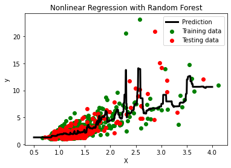
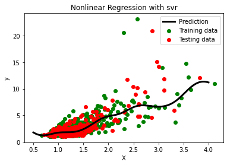
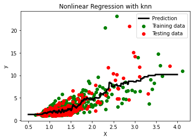
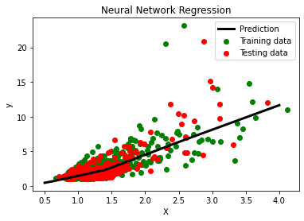
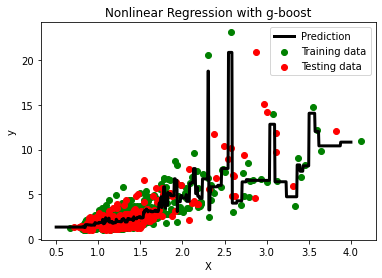
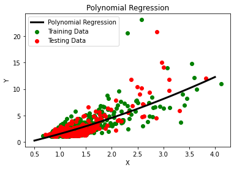
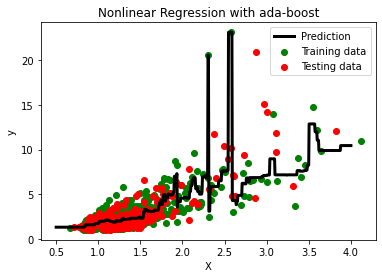
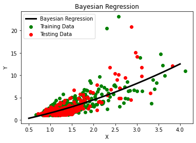
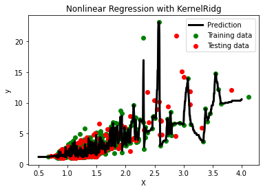

# Machine_learning-deep_learning_11_algorithms-of-non_linear_regression

I have created a python code called `regression_algorithms.ipynb` for understanding how we are able to implement different approaches of non-linear regression algorithms in machine learning. Non-linear regression algorithms are machine learning techniques used to model and predict non-linear relationships between input variables and target variables. These algorithms aim to capture complex patterns and interactions that cannot be effectively represented by a linear model. Here are some popular non-linear regression algorithms:

1. Decision Trees: Decision trees can be used for non-linear regression by partitioning the input space into regions based on different features and predicting the target variable based on the average or majority value of the samples within each region. The result of our code for this algorithm is follows:

2. Random Forest: Random Forest is an ensemble learning method that combines multiple decision trees to make predictions. It can capture non-linear relationships by aggregating the predictions of individual trees. The result of our code for this algorithm is follows:

3. Support Vector Regression (SVR): SVR is a variation of Support Vector Machines (SVM) used for regression tasks. It uses kernel functions to transform the data into a higher-dimensional space, where a linear regression model is applied to capture non-linear relationships. The result of our code for this algorithm is follows:

4. K-Nearest Neighbors (KNN): KNN is a simple non-parametric algorithm that predicts the target variable based on the average of the nearest neighbors in the input space. It can capture non-linear relationships by considering the local structure of the data.The result of our code for this algorithm is follows:

5. Artificial Neural Networks (ANN): ANNs are powerful models that consist of interconnected nodes (neurons) organized in layers. By adjusting the weights and biases of the network during the training process, ANNs can learn complex non-linear relationships between inputs and outputs. The result of our code for this algorithm is follows:

6. Gradient Boosting: Gradient Boosting algorithms, such as XGBoost and LightGBM, combine weak learners (e.g., decision trees) in a sequential manner, with each subsequent model focused on correcting the errors made by the previous models. This iterative process helps capture non-linear relationships effectively. The result of our code for this algorithm is follows:

7. Polynomial regression: It is a form of regression analysis in which the relationship between the independent variable (input) and the dependent variable (target) is modeled as an nth-degree polynomial. In polynomial regression, the input data is transformed by adding polynomial terms of different degrees. For example, a second-degree polynomial regression would include the original input features as well as their squared terms. The model then fits a polynomial function to the data, allowing for non-linear relationships to be captured. Polynomial regression can be useful when the relationship between the variables cannot be adequately captured by a linear model. It can fit curves and capture non-linear patterns in the data. However, it’s important to note that as the degree of the polynomial increases, the model becomes more flexible and can overfit the data if not properly regularized. The result of our code for this algorithm is follows:

8. AdaBoost Regression: While AdaBoost is widely known for its application in classification problems, it can be adapted for regression by modifying the algorithm’s loss function and the way weak models are combined. It can capture non-linear relationships between the input features and the target variable by leveraging the capabilities of the weak regression models. It has been used in various regression tasks, such as predicting housing prices, stock market prices, and demand forecasting. The result of our code for this algorithm is follows:

9. Extra Trees Regression: short for Extremely Randomized Trees Regression, is an ensemble learning method used for regression tasks. It is a variation of the Random Forest algorithm that introduces additional randomness during the construction of individual decision trees. In Extra Trees Regression, multiple decision trees are trained on different random subsets of the training data and random subsets of features. During the tree construction process, instead of finding the best-split point based on a criterion like Gini impurity or information gain, Extra Trees randomly selects split points without considering the optimal threshold. This randomization helps to reduce overfitting and increase the diversity among the trees. The result of our code for this algorithm is follows:

10. Bayesian Ridge Regression: Bayesian Ridge Regression is a regression algorithm that combines the Bayesian framework with ridge regression. It is a probabilistic regression model that estimates the underlying relationship between the input features and the target variable. In Bayesian Ridge Regression, a prior distribution is placed on the regression coefficients, and the algorithm uses Bayesian inference to estimate the posterior distribution of the coefficients given the data. The algorithm considers both the observed data and the prior information to make predictions. The ridge regression component of Bayesian Ridge Regression introduces a regularization term to the model, which helps to mitigate overfitting by penalizing large coefficient values. This regularization term is controlled by a hyperparameter called the regularization parameter or alpha. By adjusting the alpha value, you can control the trade-off between model complexity and model fit to the data. The result of our code for this algorithm is follows:

11. Kernel Ridge Regression: this is a non-linear regression algorithm that combines Ridge Regression with a kernel function. It is a powerful technique for handling non-linear relationships between the input features and the target variable. In Kernel Ridge Regression, the input data is mapped to a higher-dimensional feature space using a kernel function, which allows capturing complex non-linear relationships. The algorithm then applies Ridge Regression in this transformed feature space to find the optimal weights for the regression model. The key idea behind Kernel Ridge Regression is to perform regularization by adding a penalty term to the loss function, which helps to prevent overfitting and improve generalization. The penalty term includes the squared magnitude of the weight vector, as well as a regularization parameter called the alpha parameter. The result of our code for this algorithm is follows:

Reference: Some Information was provided by ChatGPT
