```python
#Importing the Libraries
import numpy as np
import pandas as pd
import datetime
import matplotlib
import matplotlib.pyplot as plt
from matplotlib import colors
import seaborn as sns
from sklearn.preprocessing import LabelEncoder
from sklearn.preprocessing import StandardScaler
from sklearn.decomposition import PCA
from yellowbrick.cluster import KElbowVisualizer
from sklearn.cluster import KMeans
import matplotlib.pyplot as plt, numpy as np
from mpl_toolkits.mplot3d import Axes3D
from sklearn.cluster import AgglomerativeClustering
from matplotlib.colors import ListedColormap
from sklearn import metrics
import warnings
import sys
if not sys.warnoptions:
    warnings.simplefilter("ignore")
np.random.seed(42)
```


```python
#Loading the dataset
#reading data
Data = pd.read_csv("marketing_campaign.csv", sep="\t")
Data.head()


```


<div>
<style scoped>
    .dataframe tbody tr th:only-of-type {
        vertical-align: middle;
    }

    .dataframe tbody tr th {
        vertical-align: top;
    }

    .dataframe thead th {
        text-align: right;
    }
</style>
<table border="1" class="dataframe">
  <thead>
    <tr style="text-align: right;">
      <th></th>
      <th>ID</th>
      <th>Year_Birth</th>
      <th>Education</th>
      <th>Marital_Status</th>
      <th>Income</th>
      <th>Kidhome</th>
      <th>Teenhome</th>
      <th>Dt_Customer</th>
      <th>Recency</th>
      <th>MntWines</th>
      <th>...</th>
      <th>NumWebVisitsMonth</th>
      <th>AcceptedCmp3</th>
      <th>AcceptedCmp4</th>
      <th>AcceptedCmp5</th>
      <th>AcceptedCmp1</th>
      <th>AcceptedCmp2</th>
      <th>Complain</th>
      <th>Z_CostContact</th>
      <th>Z_Revenue</th>
      <th>Response</th>
    </tr>
  </thead>
  <tbody>
    <tr>
      <th>0</th>
      <td>5524</td>
      <td>1957</td>
      <td>Graduation</td>
      <td>Single</td>
      <td>58138.0</td>
      <td>0</td>
      <td>0</td>
      <td>04-09-2012</td>
      <td>58</td>
      <td>635</td>
      <td>...</td>
      <td>7</td>
      <td>0</td>
      <td>0</td>
      <td>0</td>
      <td>0</td>
      <td>0</td>
      <td>0</td>
      <td>3</td>
      <td>11</td>
      <td>1</td>
    </tr>
    <tr>
      <th>1</th>
      <td>2174</td>
      <td>1954</td>
      <td>Graduation</td>
      <td>Single</td>
      <td>46344.0</td>
      <td>1</td>
      <td>1</td>
      <td>08-03-2014</td>
      <td>38</td>
      <td>11</td>
      <td>...</td>
      <td>5</td>
      <td>0</td>
      <td>0</td>
      <td>0</td>
      <td>0</td>
      <td>0</td>
      <td>0</td>
      <td>3</td>
      <td>11</td>
      <td>0</td>
    </tr>
    <tr>
      <th>2</th>
      <td>4141</td>
      <td>1965</td>
      <td>Graduation</td>
      <td>Together</td>
      <td>71613.0</td>
      <td>0</td>
      <td>0</td>
      <td>21-08-2013</td>
      <td>26</td>
      <td>426</td>
      <td>...</td>
      <td>4</td>
      <td>0</td>
      <td>0</td>
      <td>0</td>
      <td>0</td>
      <td>0</td>
      <td>0</td>
      <td>3</td>
      <td>11</td>
      <td>0</td>
    </tr>
    <tr>
      <th>3</th>
      <td>6182</td>
      <td>1984</td>
      <td>Graduation</td>
      <td>Together</td>
      <td>26646.0</td>
      <td>1</td>
      <td>0</td>
      <td>10-02-2014</td>
      <td>26</td>
      <td>11</td>
      <td>...</td>
      <td>6</td>
      <td>0</td>
      <td>0</td>
      <td>0</td>
      <td>0</td>
      <td>0</td>
      <td>0</td>
      <td>3</td>
      <td>11</td>
      <td>0</td>
    </tr>
    <tr>
      <th>4</th>
      <td>5324</td>
      <td>1981</td>
      <td>PhD</td>
      <td>Married</td>
      <td>58293.0</td>
      <td>1</td>
      <td>0</td>
      <td>19-01-2014</td>
      <td>94</td>
      <td>173</td>
      <td>...</td>
      <td>5</td>
      <td>0</td>
      <td>0</td>
      <td>0</td>
      <td>0</td>
      <td>0</td>
      <td>0</td>
      <td>3</td>
      <td>11</td>
      <td>0</td>
    </tr>
  </tbody>
</table>
<p>5 rows × 29 columns</p>
</div>


```python
Data.info()
```

    <class 'pandas.core.frame.DataFrame'>
    RangeIndex: 2240 entries, 0 to 2239
    Data columns (total 29 columns):
     #   Column               Non-Null Count  Dtype  
    ---  ------               --------------  -----  
     0   ID                   2240 non-null   int64  
     1   Year_Birth           2240 non-null   int64  
     2   Education            2240 non-null   object 
     3   Marital_Status       2240 non-null   object 
     4   Income               2216 non-null   float64
     5   Kidhome              2240 non-null   int64  
     6   Teenhome             2240 non-null   int64  
     7   Dt_Customer          2240 non-null   object 
     8   Recency              2240 non-null   int64  
     9   MntWines             2240 non-null   int64  
     10  MntFruits            2240 non-null   int64  
     11  MntMeatProducts      2240 non-null   int64  
     12  MntFishProducts      2240 non-null   int64  
     13  MntSweetProducts     2240 non-null   int64  
     14  MntGoldProds         2240 non-null   int64  
     15  NumDealsPurchases    2240 non-null   int64  
     16  NumWebPurchases      2240 non-null   int64  
     17  NumCatalogPurchases  2240 non-null   int64  
     18  NumStorePurchases    2240 non-null   int64  
     19  NumWebVisitsMonth    2240 non-null   int64  
     20  AcceptedCmp3         2240 non-null   int64  
     21  AcceptedCmp4         2240 non-null   int64  
     22  AcceptedCmp5         2240 non-null   int64  
     23  AcceptedCmp1         2240 non-null   int64  
     24  AcceptedCmp2         2240 non-null   int64  
     25  Complain             2240 non-null   int64  
     26  Z_CostContact        2240 non-null   int64  
     27  Z_Revenue            2240 non-null   int64  
     28  Response             2240 non-null   int64  
    dtypes: float64(1), int64(25), object(3)
    memory usage: 507.6+ KB


```python
#checking missing values
null_values = Data.isnull().sum()
print(null_values)
```

    ID                      0
    Year_Birth              0
    Education               0
    Marital_Status          0
    Income                 24
    Kidhome                 0
    Teenhome                0
    Dt_Customer             0
    Recency                 0
    MntWines                0
    MntFruits               0
    MntMeatProducts         0
    MntFishProducts         0
    MntSweetProducts        0
    MntGoldProds            0
    NumDealsPurchases       0
    NumWebPurchases         0
    NumCatalogPurchases     0
    NumStorePurchases       0
    NumWebVisitsMonth       0
    AcceptedCmp3            0
    AcceptedCmp4            0
    AcceptedCmp5            0
    AcceptedCmp1            0
    AcceptedCmp2            0
    Complain                0
    Z_CostContact           0
    Z_Revenue               0
    Response                0
    dtype: int64


```python
#checking duplicated values
duplicate_values = Data[Data.duplicated()]
print(duplicate_values)
```

    Empty DataFrame
    Columns: [ID, Year_Birth, Education, Marital_Status, Income, Kidhome, Teenhome, Dt_Customer, Recency, MntWines, MntFruits, MntMeatProducts, MntFishProducts, MntSweetProducts, MntGoldProds, NumDealsPurchases, NumWebPurchases, NumCatalogPurchases, NumStorePurchases, NumWebVisitsMonth, AcceptedCmp3, AcceptedCmp4, AcceptedCmp5, AcceptedCmp1, AcceptedCmp2, Complain, Z_CostContact, Z_Revenue, Response]
    Index: []
    
    [0 rows x 29 columns]


```python
##rectifying missing values
from sklearn.experimental import enable_iterative_imputer
from sklearn.impute import IterativeImputer
df = pd.DataFrame(Data)
columns_to_fill = ['Income']
#df.drop('ID', axis=1,inplace=True)
fill_cols = [col for col in columns_to_fill]
itr_imputer = IterativeImputer(initial_strategy='median', min_value=0, random_state=100)
df[fill_cols] = itr_imputer.fit_transform(df[fill_cols])
plt.figure(figsize = (14,10))
sns.heatmap(df.isnull(), cmap= 'PiYG', cbar=False, yticklabels=False, xticklabels=df.columns)
```


    <AxesSubplot:>


    
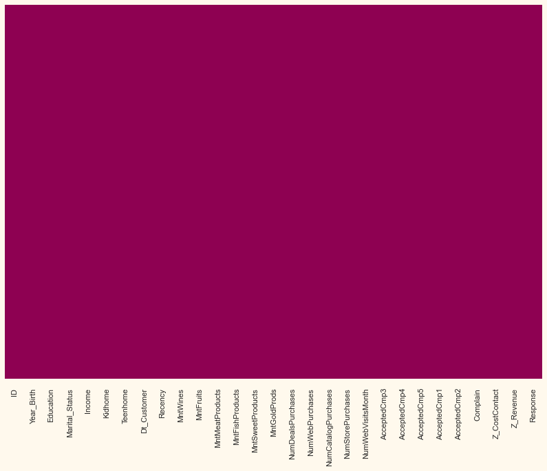
    


```python
#Dt_Customer_N=df.set_index(['Dt_Customer'])
#Dt_Customer_N.index=pd.to_datetime(Dt_Customer_N.index, infer_datetime_format= True)
#Data["Dt_Customer_N"] = Data["Dt_Customer"]
#print(Dt_Customer_N)
#Data.head()

```


```python
# feature engineering :  
#We are adding new columns to data
Data["Age"] = 2023-Data["Year_Birth"]
Data["Children"]=Data["Kidhome"]+Data["Teenhome"]
#REPLACING
Data["Education"]=Data["Education"].replace({"Basic":"Undergraduate","2n Cycle":"Undergraduate", "Graduation":"Graduate", "Master":"Postgraduate", "PhD":"Postgraduate"})
#renaming
Data=Data.rename(columns={"MntWines": "Wines","MntFruits":"Fruits","MntMeatProducts":"Meat","MntFishProducts":"Fish","MntSweetProducts":"Sweets","MntGoldProds":"Gold"})
#Feature pertaining parenthood
Data["Is_Parent"] = np.where(Data.Children> 0, 1, 0)
#Dropping some of the redundant features
to_drop = ["Marital_Status", "Dt_Customer", "Z_CostContact", "Z_Revenue", "Year_Birth", "ID", "Kidhome", "Teenhome", "AcceptedCmp1", "AcceptedCmp2", "AcceptedCmp3", "AcceptedCmp4", "AcceptedCmp5"]
Data = Data.drop(to_drop, axis=1)
Data.head()

```


<div>
<style scoped>
    .dataframe tbody tr th:only-of-type {
        vertical-align: middle;
    }

    .dataframe tbody tr th {
        vertical-align: top;
    }

    .dataframe thead th {
        text-align: right;
    }
</style>
<table border="1" class="dataframe">
  <thead>
    <tr style="text-align: right;">
      <th></th>
      <th>Education</th>
      <th>Income</th>
      <th>Recency</th>
      <th>Wines</th>
      <th>Fruits</th>
      <th>Meat</th>
      <th>Fish</th>
      <th>Sweets</th>
      <th>Gold</th>
      <th>NumDealsPurchases</th>
      <th>NumWebPurchases</th>
      <th>NumCatalogPurchases</th>
      <th>NumStorePurchases</th>
      <th>NumWebVisitsMonth</th>
      <th>Complain</th>
      <th>Response</th>
      <th>Age</th>
      <th>Children</th>
      <th>Is_Parent</th>
    </tr>
  </thead>
  <tbody>
    <tr>
      <th>0</th>
      <td>Graduate</td>
      <td>58138.0</td>
      <td>58</td>
      <td>635</td>
      <td>88</td>
      <td>546</td>
      <td>172</td>
      <td>88</td>
      <td>88</td>
      <td>3</td>
      <td>8</td>
      <td>10</td>
      <td>4</td>
      <td>7</td>
      <td>0</td>
      <td>1</td>
      <td>66</td>
      <td>0</td>
      <td>0</td>
    </tr>
    <tr>
      <th>1</th>
      <td>Graduate</td>
      <td>46344.0</td>
      <td>38</td>
      <td>11</td>
      <td>1</td>
      <td>6</td>
      <td>2</td>
      <td>1</td>
      <td>6</td>
      <td>2</td>
      <td>1</td>
      <td>1</td>
      <td>2</td>
      <td>5</td>
      <td>0</td>
      <td>0</td>
      <td>69</td>
      <td>2</td>
      <td>1</td>
    </tr>
    <tr>
      <th>2</th>
      <td>Graduate</td>
      <td>71613.0</td>
      <td>26</td>
      <td>426</td>
      <td>49</td>
      <td>127</td>
      <td>111</td>
      <td>21</td>
      <td>42</td>
      <td>1</td>
      <td>8</td>
      <td>2</td>
      <td>10</td>
      <td>4</td>
      <td>0</td>
      <td>0</td>
      <td>58</td>
      <td>0</td>
      <td>0</td>
    </tr>
    <tr>
      <th>3</th>
      <td>Graduate</td>
      <td>26646.0</td>
      <td>26</td>
      <td>11</td>
      <td>4</td>
      <td>20</td>
      <td>10</td>
      <td>3</td>
      <td>5</td>
      <td>2</td>
      <td>2</td>
      <td>0</td>
      <td>4</td>
      <td>6</td>
      <td>0</td>
      <td>0</td>
      <td>39</td>
      <td>1</td>
      <td>1</td>
    </tr>
    <tr>
      <th>4</th>
      <td>Postgraduate</td>
      <td>58293.0</td>
      <td>94</td>
      <td>173</td>
      <td>43</td>
      <td>118</td>
      <td>46</td>
      <td>27</td>
      <td>15</td>
      <td>5</td>
      <td>5</td>
      <td>3</td>
      <td>6</td>
      <td>5</td>
      <td>0</td>
      <td>0</td>
      <td>42</td>
      <td>1</td>
      <td>1</td>
    </tr>
  </tbody>
</table>
</div>


```python
## data analysis
##correlations: high correlations are in red
correlation = Data.corr(method='pearson')
fig, ax = plt.subplots()
ax.figure.set_size_inches(24, 24)
# a mask for the upper triangle
mask = np.triu(np.ones_like(correlation, dtype=np.bool))
# plots the coorelations
sns.heatmap(correlation, cmap='rainbow', mask=mask, square=True, linewidths=.5, annot=True, annot_kws={'size':14})
plt.show()
```


    
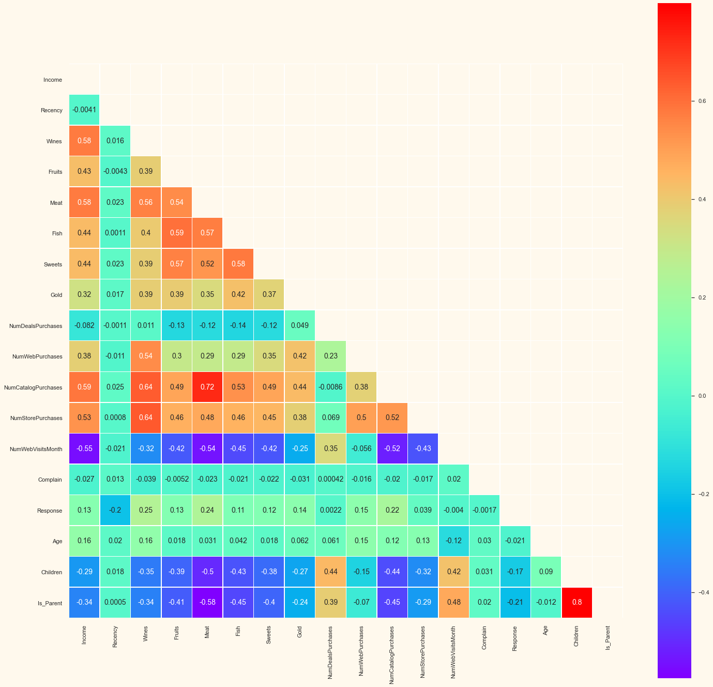
    


```python
## data analysis
#plotting some selected features 
#Setting up colors prefrences
sns.set(rc={"axes.facecolor":"#FFF9ED","figure.facecolor":"#FFF9ED"})
pallet = ["#682F2F", "#9E726F", "#D6B2B1", "#B9C0C9", "#9F8A78", "#F3AB60"]
cmap = colors.ListedColormap(["#682F2F", "#9E726F", "#D6B2B1", "#B9C0C9", "#9F8A78", "#F3AB60"])
#Plotting following features
To_Plot = ["Income", "Recency", "Age", "Is_Parent"]
print("Reletive Plot Of Some Selected Features: A Data Subset")
plt.figure()
sns.pairplot(Data[To_Plot], hue= "Is_Parent")
#Taking hue 
plt.show()
```

    Reletive Plot Of Some Selected Features: A Data Subset


    <Figure size 576x396 with 0 Axes>


    
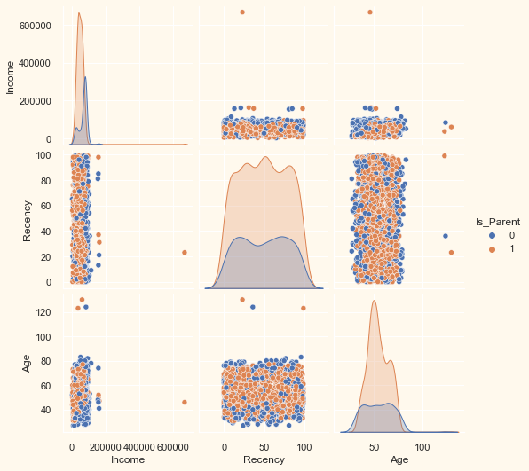
    


```python
## data analysis: histograms
fill_cols = [col for col in Data.columns]
fig1, ax = plt.subplots(len(fill_cols),1,figsize=(10,50))
for i, col in enumerate(Data):
    ##FOR NOT HAVING LINE REMOVE kde = True
    sns.histplot(Data[col], kde=True, ax=ax[i])
fig1.tight_layout()
plt.show()
```


    
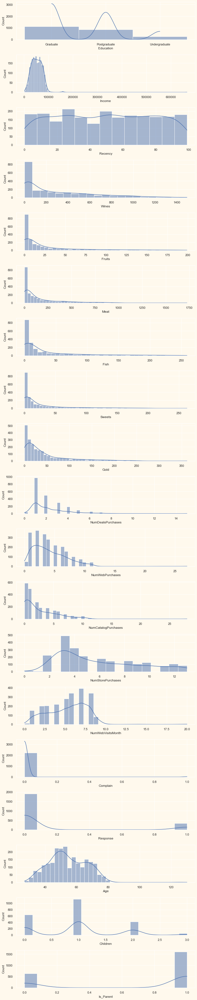
    


```python
## data analysis: categorial data to numerical data
CATEGORIAL_DATA = (Data.dtypes == 'object')
object_cols = list(CATEGORIAL_DATA[CATEGORIAL_DATA].index)
print("Categorical Column=>", object_cols)
```

    Categorical Column=> ['Education']


```python
#converting categorial data to numerical data
LE=LabelEncoder()
for i in object_cols:
    Data[i]=Data[[i]].apply(LE.fit_transform)
    
print("All features are numerical")
```

    All features are numerical


```python
scaler = StandardScaler()
scaled_data = scaler.fit_transform(Data)
plt.figure(figsize=(20,9))
sns.heatmap(scaled_data)
plt.show()
scaled_data = pd.DataFrame(scaled_data)

```


    
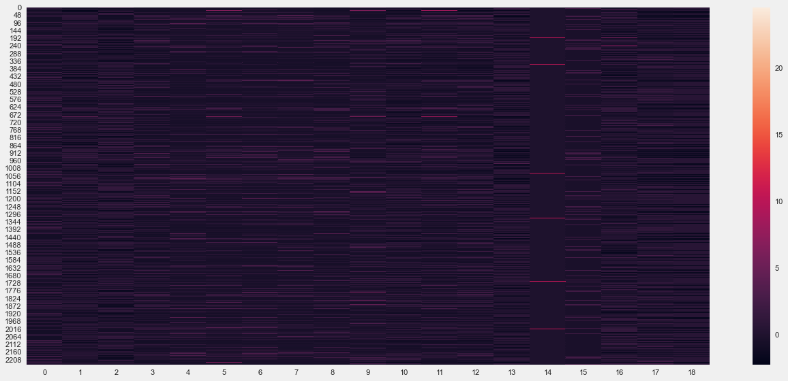
    


```python
## selecting cluster number, max in the curve is the prefered cluster numebr
from sklearn.metrics import silhouette_score
##The first step is to randomly choose k centroids, where k is number of clusters
##The random initialization step causes the k-means algorithm to be  varied if you run the same algorithm twice on the same data
kmeans_set = {"init":"random", "max_iter":200,"random_state":42}
## next step we should define the number of clusters by a method here I used silhouette_coefficients.
silhouette_coefficients =[]
for k in range(2,len(fill_cols)+1):
    kmeans=KMeans(n_clusters=k,**kmeans_set).fit(scaled_data)
    score=silhouette_score(scaled_data,kmeans.labels_)
    silhouette_coefficients.append(score)
plt.style.use("fivethirtyeight")
plt.plot(range(2,len(fill_cols)+1),silhouette_coefficients,marker='o')
plt.xticks(range(2,len(fill_cols)+1))
plt.xlabel("Number of Clusters")
plt.ylabel("silhouette coefficients")
plt.show()

```


    
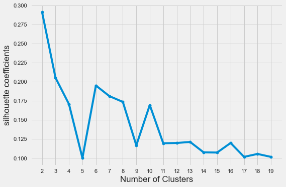
    


```python
## method: K-mean
kmeans = KMeans(n_clusters=2,**kmeans_set).fit(scaled_data)
cluster_centers = pd.DataFrame(data = kmeans.cluster_centers_, columns = [Data.columns])
cluster_centers = scaler.inverse_transform(cluster_centers)
cluster_centers = pd.DataFrame(data = cluster_centers, columns = [Data.columns])
labels = kmeans.labels_
data_cluster_with_kmean = pd.concat([Data, pd.DataFrame({'cluster': labels})], axis = 1)
ax = sns.countplot(data=data_cluster_with_kmean, x='cluster', palette='Accent_r', saturation=1, linewidth = 1)

```


    
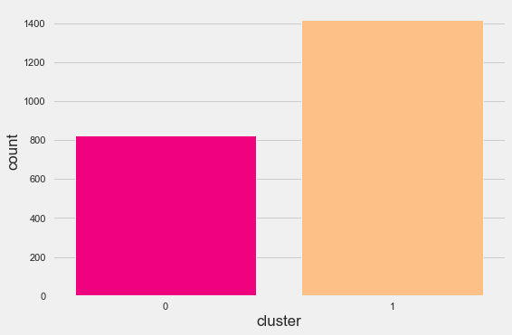
    


```python
##visualizing k-mean results on original data
kmeans = KMeans(n_clusters=2,init= "random", random_state = 1).fit(Data)
centroids = kmeans.cluster_centers_
plt.figure(figsize=(15,8))
Data_kmean = Data.copy()
Data_kmean['cluster'] = kmeans.labels_
sns.relplot(data = Data_kmean ,x='Age' , y  ='Income', hue='cluster', palette='Accent' ,kind='scatter', height=8.27, aspect = 11.7/8.27)
plt.scatter(centroids[:, 0], centroids[:,1], c='red', s=50)
plt.xlabel("Age",fontsize=15)
plt.ylabel("Income",fontsize=15)
```


    Text(14.315430614909786, 0.5, 'Income')


    <Figure size 1080x576 with 0 Axes>


    
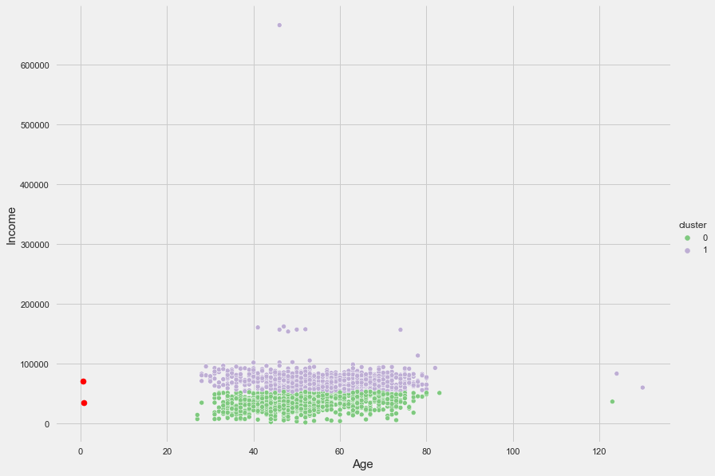
    


```python
# visualizing K-mean for all columns
best_cols = ["Education", "Income", "Recency","Wines", "Fruits", "Meat","Gold","cluster"]
sns.pairplot( data_cluster_with_kmean[ best_cols ], hue="cluster",palette='Accent')  
```


    <seaborn.axisgrid.PairGrid at 0x128eee340>


    
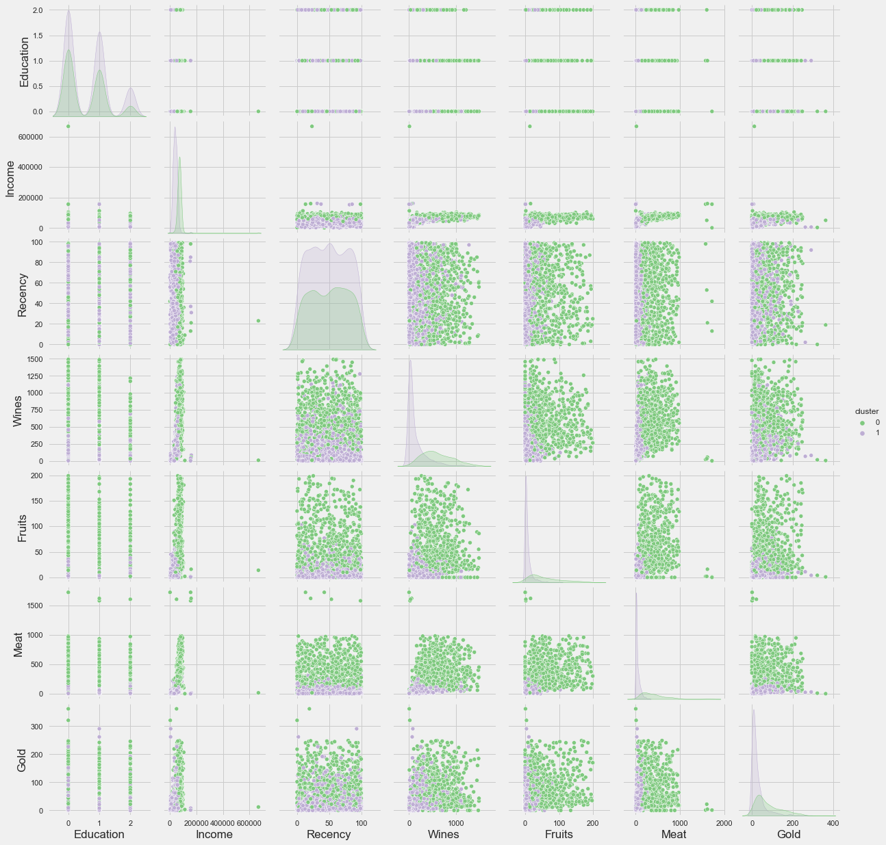
    


```python
## method: AgglomerativeClustering
# we select number of clusters based on analysis
from scipy.cluster.hierarchy import dendrogram, linkage
# Compute the linkage matrix
linkage_matrix = linkage(Data, method='ward')
# Plot the dendrogram
plt.figure(figsize=(10, 6))
dendrogram(linkage_matrix)
plt.xlabel('Data Points')
plt.ylabel('Distance')
plt.title('Dendrogram')
plt.show()


```


    
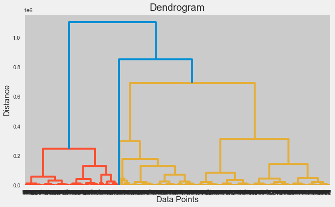
    


    
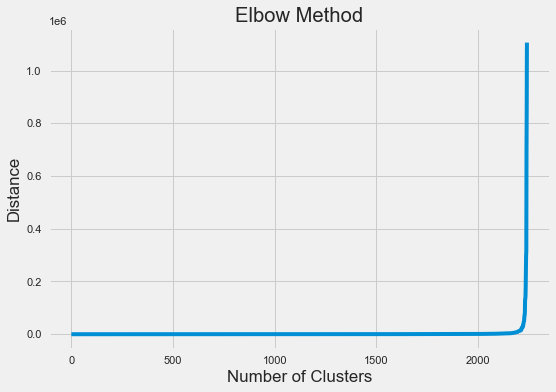
    


```python
from sklearn.cluster import AgglomerativeClustering
# Initialize the Agglomerative Clustering model
agg_clustering = AgglomerativeClustering(n_clusters=5)
# Fit the Agglomerative Clustering model to the data
agg_clustering.fit(Data)
# Extract the cluster labels
labels = agg_clustering.labels_
# Print the number of clusters
n_clusters = len(np.unique(labels))
print(f"Number of clusters: {n_clusters}")
```

    Number of clusters: 5


```python
data_agg_clustering = Data.copy()
data_agg_clustering['cluster'] = agg_clustering.labels_
sns.relplot(data = data_agg_clustering ,x='Age' , y  ='Income', hue='cluster', palette='Accent' ,kind='scatter', height=8.27, aspect = 11.7/8.27)
#plt.scatter(centroids[:, 0], centroids[:,1], c='red', s=50)
plt.xlabel("Age",fontsize=15)
plt.ylabel("Income",fontsize=15)
plt.xlabel("Age",fontsize=15)
plt.ylabel("Income",fontsize=15)
```


    Text(14.315430614909786, 0.5, 'Income')


    
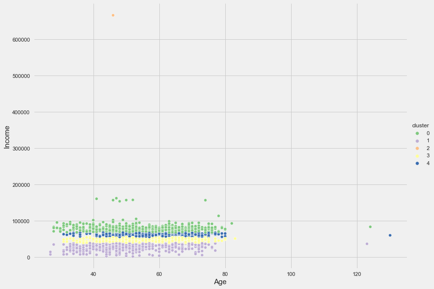
    


```python
best_cols = ["Education", "Income", "Recency","Wines", "Fruits", "Meat","Gold","cluster"]
sns.pairplot( data_agg_clustering[ best_cols ], hue="cluster",palette='Accent') 
```


    <seaborn.axisgrid.PairGrid at 0x17a5306a0>


    
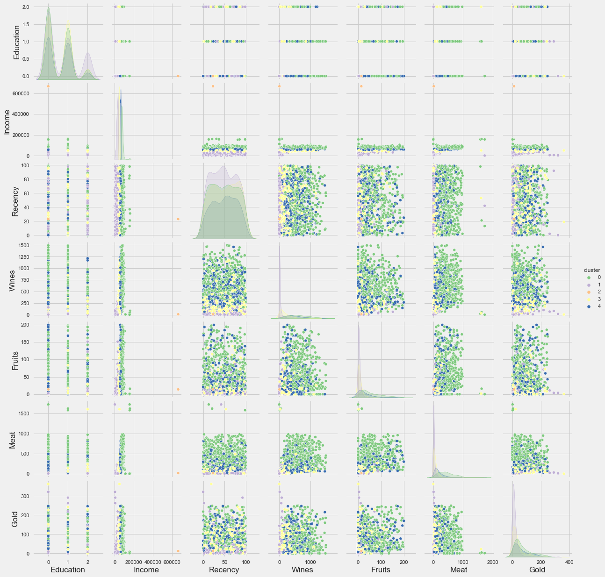
    


```python
## spectral clustering method
from sklearn.cluster import SpectralClustering

spectral = SpectralClustering(n_clusters=2).fit(Data)  # Specify the number of desired clusters

# Fit the SpectralClustering model to the data
data_Spectral = Data.copy()
data_Spectral['cluster'] = spectral.labels_
sns.relplot(data = data_Spectral ,x='Age' , y  ='Income', hue='cluster', palette='Accent' ,kind='scatter', height=8.27, aspect = 11.7/8.27)
plt.xlabel("Age",fontsize=15)
plt.ylabel("Income",fontsize=15)

```


    Text(14.315430614909786, 0.5, 'Income')


    
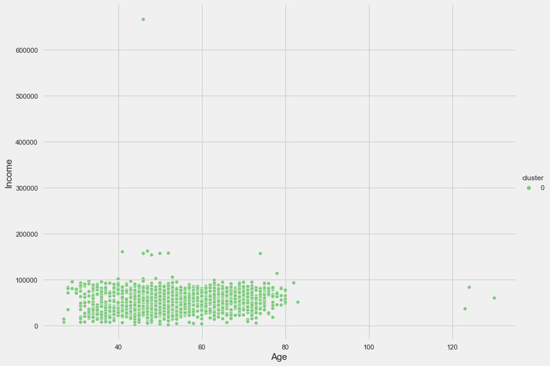
    


```python
best_cols = ["Education", "Income", "Recency","Wines", "Fruits", "Meat","Gold","cluster"]
sns.pairplot( data_Spectral[ best_cols ], hue="cluster",palette='Accent') 
```


    <seaborn.axisgrid.PairGrid at 0x1791c7280>


    
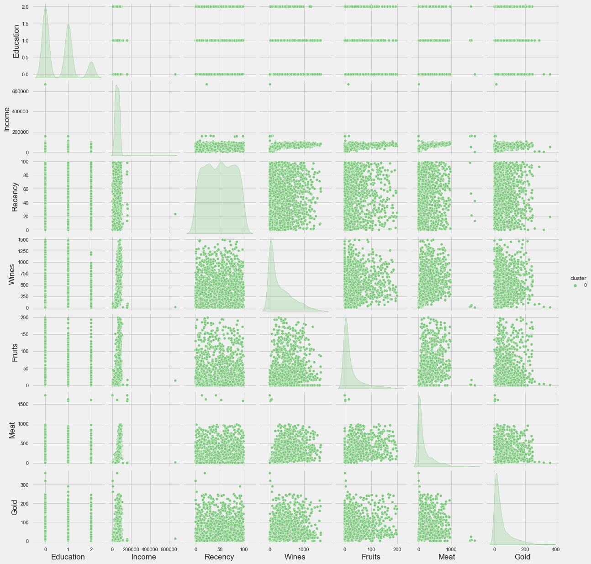
    


```python
## method: dbscan
##determining eps parameter
from sklearn.neighbors import NearestNeighbors
nbrs = NearestNeighbors(n_neighbors = 5).fit(Data)
# Find the k-neighbors of a point to get eps.
neigh_dist, neigh_ind = nbrs.kneighbors(Data)
# sort the neighbor distances (lengths to points) in ascending order
# axis = 0 represents sort along first axis i.e. sort along row
sort_neigh_dist = np.sort(neigh_dist, axis = 0)
k_dist = sort_neigh_dist[:, 4]
plt.plot(k_dist)
plt.ylabel("k-NN distance")
plt.xlabel("Sorted observations (4th NN)")
plt.show()
```


    
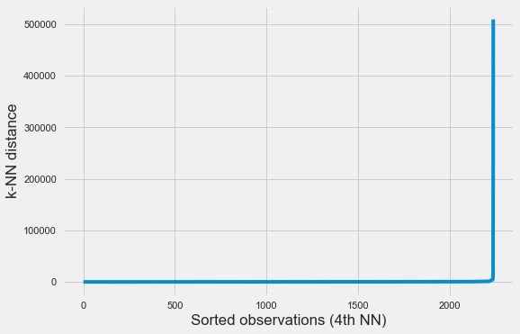
    


```python
## method: dbscan
from sklearn.cluster import DBSCAN
# Initialize the DBSCAN model
dbscan = DBSCAN(eps=2100, min_samples=100)
# Fit the DBSCAN model to the data
dbscan.fit(Data)
# Extract the cluster labels
labels = dbscan.labels_
# Print the number of clusters
n_clusters = len(np.unique(labels))
print(f"Number of clusters: {n_clusters}")


```

    Number of clusters: 2


```python
data_dbscan = Data.copy()
data_dbscan['cluster'] = dbscan.labels_
sns.relplot(data = data_dbscan ,x='Age' , y  ='Income', hue='cluster', palette='Accent' ,kind='scatter', height=8.27, aspect = 11.7/8.27)
#plt.scatter(centroids[:, 0], centroids[:,1], c='red', s=50)
plt.xlabel("Age",fontsize=15)
plt.ylabel("Income",fontsize=15)
plt.xlabel("Age",fontsize=15)
plt.ylabel("Income",fontsize=15)
```


    Text(14.577494361348528, 0.5, 'Income')


    
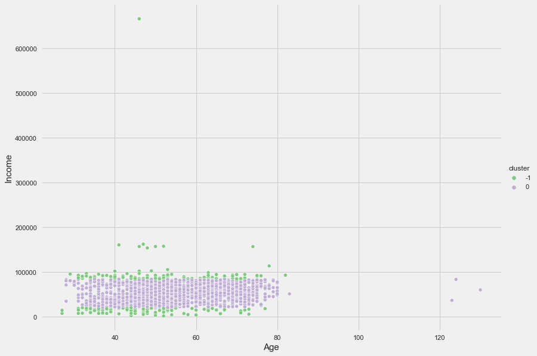
    


```python
best_cols = ["Education", "Income", "Recency","Wines", "Fruits", "Meat","Gold","cluster"]
sns.pairplot(data_dbscan[best_cols], hue="cluster",palette='Accent') 
```


    <seaborn.axisgrid.PairGrid at 0x1444963a0>


    
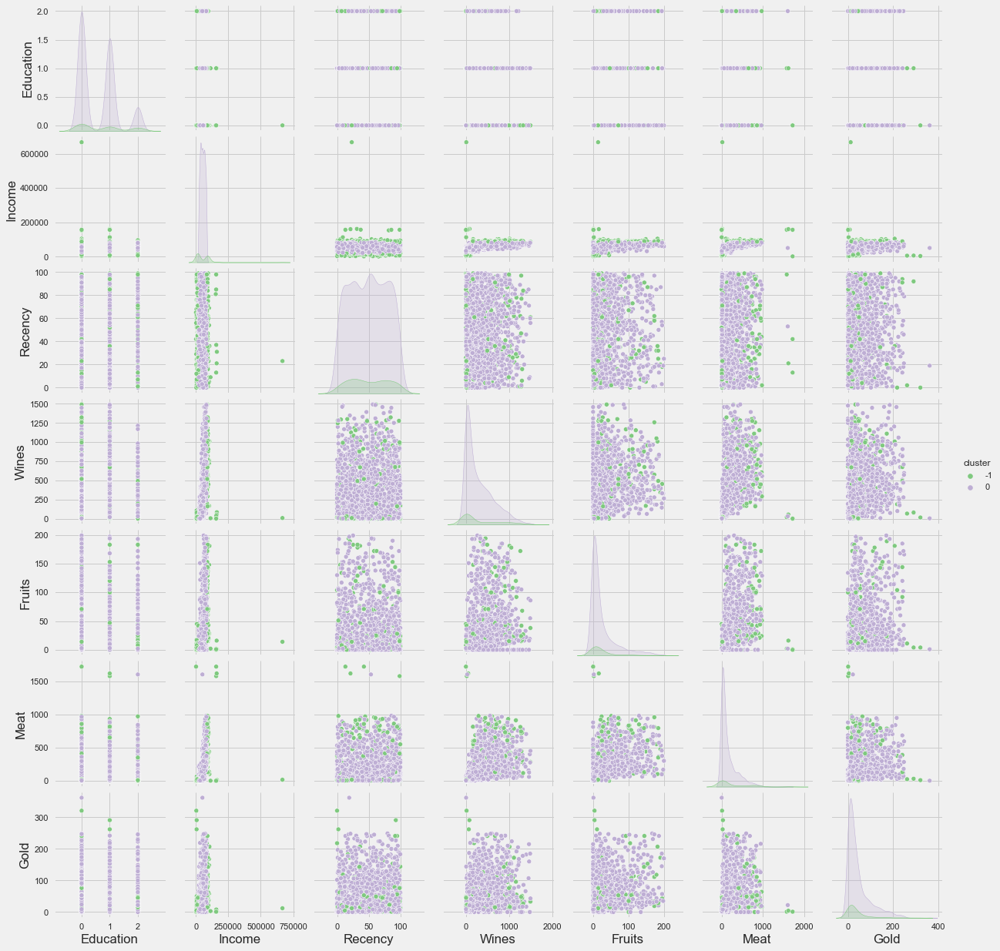
    


```python
## method: AffinityPropagation
from sklearn.cluster import AffinityPropagation
from sklearn.datasets import make_blobs

# Generate sample data

# Initialize the AffinityPropagation model
affinity_propagation = AffinityPropagation(damping=0.84, preference=None)

# Fit the AffinityPropagation model to the data
affinity_propagation = affinity_propagation.fit(Data)

# Get the cluster labels and cluster centers
labels = affinity_propagation.labels_
cluster_centers = affinity_propagation.cluster_centers_
# Print the number of identified clusters
n_clusters = len(cluster_centers)
print(f"Number of clusters: {n_clusters}")


```

    Number of clusters: 22


```python
data_affinity_propagation = Data.copy()
data_affinity_propagation['cluster'] = affinity_propagation.labels_
sns.relplot(data = data_affinity_propagation ,x='Age' , y  ='Income', hue='cluster', palette='Accent' ,kind='scatter', height=8.27, aspect = 11.7/8.27)
#plt.scatter(centroids[:, 0], centroids[:,1], c='red', s=50)
plt.xlabel("Age",fontsize=15)
plt.ylabel("Income",fontsize=15)
plt.xlabel("Age",fontsize=15)
plt.ylabel("Income",fontsize=15)
```


    Text(14.743468067426406, 0.5, 'Income')


    
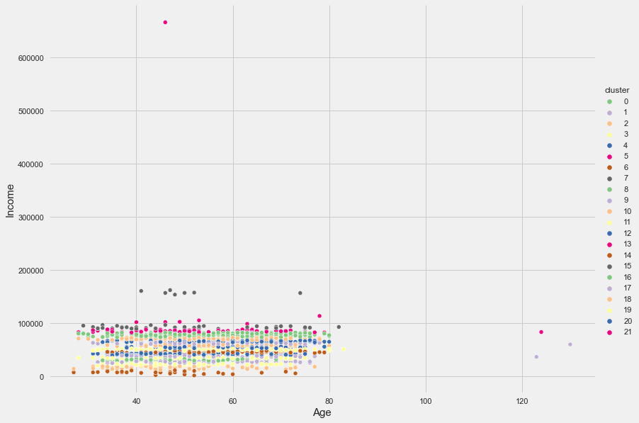
    


```python
best_cols = ["Education", "Income", "Recency","Wines", "Fruits", "Meat","Gold","cluster"]
sns.pairplot(data_affinity_propagation[ best_cols ], hue="cluster",palette='Accent') 
```


    <seaborn.axisgrid.PairGrid at 0x179d599a0>


    
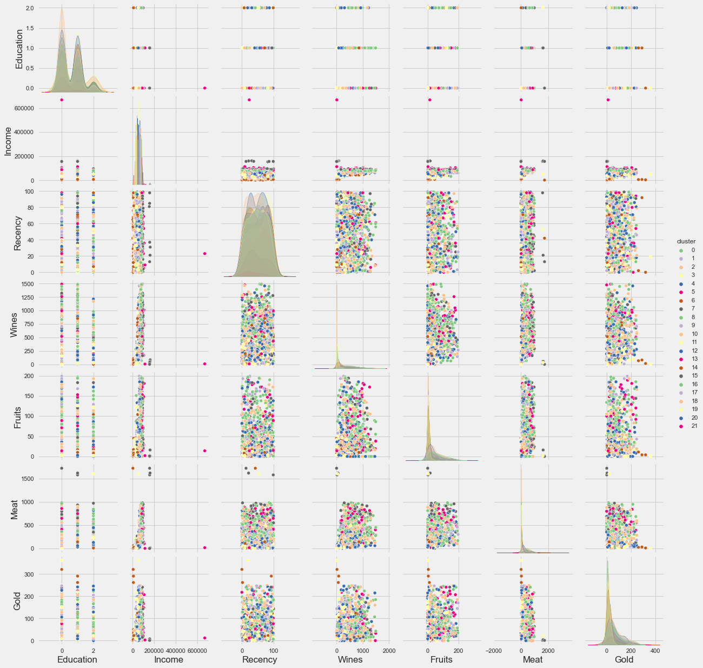
    


```python
# method OPTICS
from sklearn.cluster import OPTICS
optics = OPTICS(min_samples=5, xi=0.05, min_cluster_size=0.1)

# Fit the OPTICS model to the data
optics.fit(Data)

# Extract the cluster labels
labels = optics.labels_

# Print the number of clusters
n_clusters = len(np.unique(labels))
print(f"Number of clusters: {n_clusters}")

```

    Number of clusters: 4


```python
data_optics = Data.copy()
data_optics['cluster'] = optics.labels_
sns.relplot(data = data_optics ,x='Age' , y  ='Income', hue='cluster', palette='Accent' ,kind='scatter', height=8.27, aspect = 11.7/8.27)
#plt.scatter(centroids[:, 0], centroids[:,1], c='red', s=50)
plt.xlabel("Age",fontsize=15)
plt.ylabel("Income",fontsize=15)
plt.xlabel("Age",fontsize=15)
plt.ylabel("Income",fontsize=15)
```


    Text(14.577494361348528, 0.5, 'Income')


    
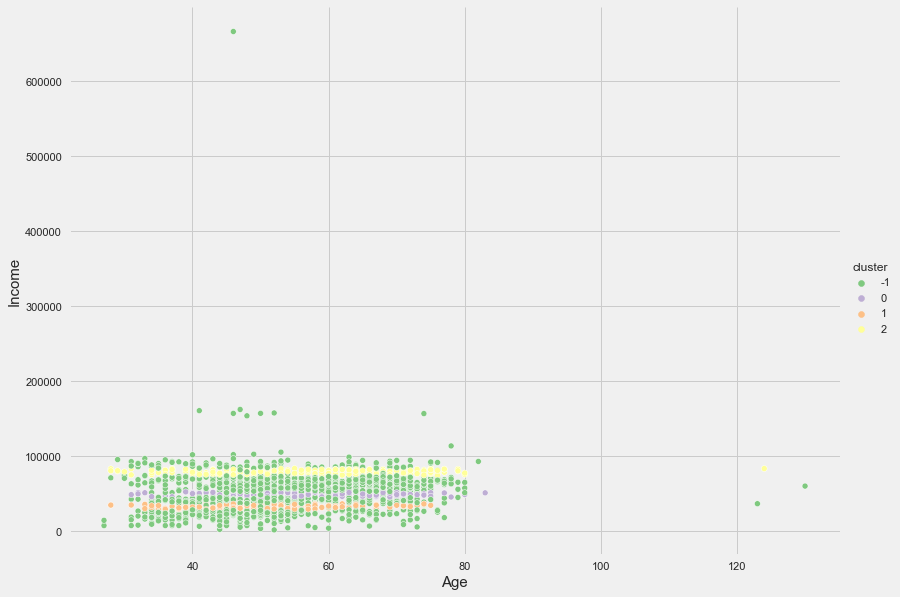
    


```python
best_cols = ["Education", "Income", "Recency","Wines", "Fruits", "Meat","Gold","cluster"]
sns.pairplot(data_optics [ best_cols ], hue="cluster",palette='Accent') 
```


    <seaborn.axisgrid.PairGrid at 0x14e951dc0>


    
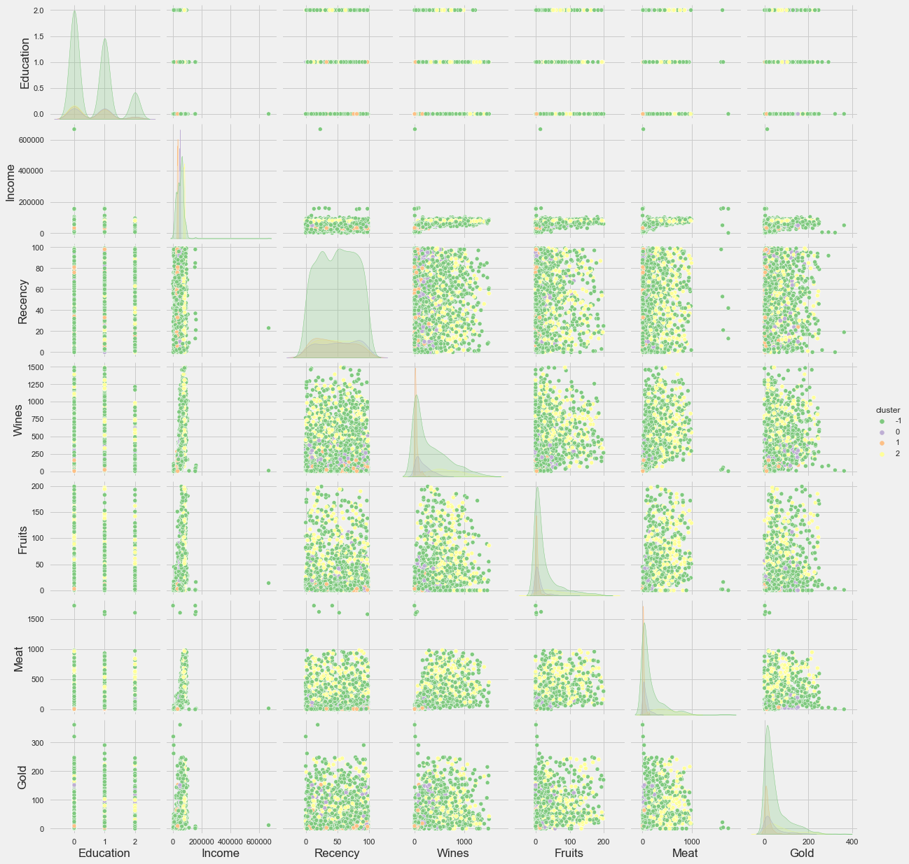
    


```python
## method GaussianMixture
from sklearn.mixture import GaussianMixture

# Initialize the GMM model
gmm = GaussianMixture(n_components=3, random_state=0)

# Fit the GMM model to the data
gmm.fit(Data)

# Predict the cluster labels for the data points
labels = gmm.predict(Data)

# Print the number of clusters
n_clusters = len(np.unique(labels))
print(f"Number of clusters: {n_clusters}")
```

    Number of clusters: 3


```python
data_gmm = Data.copy()
data_gmm['cluster'] = gmm.labels_
sns.relplot(data = data_gmm ,x='Age' , y  ='Income', hue='cluster', palette='Accent' ,kind='scatter', height=8.27, aspect = 11.7/8.27)
#plt.scatter(centroids[:, 0], centroids[:,1], c='red', s=50)
plt.xlabel("Age",fontsize=15)
plt.ylabel("Income",fontsize=15)
plt.xlabel("Age",fontsize=15)
plt.ylabel("Income",fontsize=15)
```


    Text(14.315430614909786, 0.5, 'Income')


    
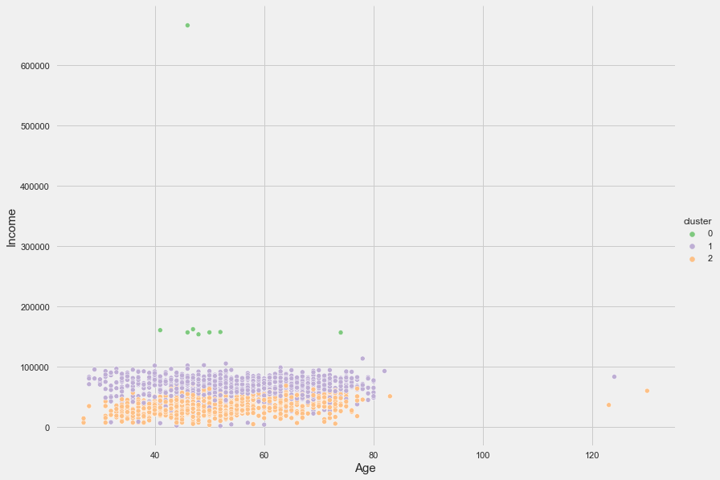
    


```python
best_cols = ["Education", "Income", "Recency","Wines", "Fruits", "Meat","Gold","cluster"]
sns.pairplot(data_gmm [ best_cols ], hue="cluster",palette='Accent') 
```


    <seaborn.axisgrid.PairGrid at 0x157f277c0>


    
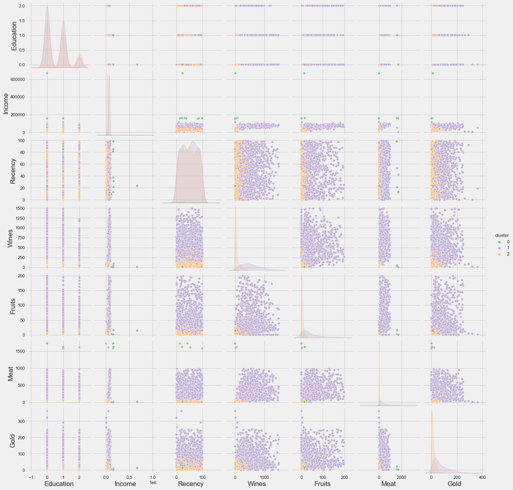
    


```python
## method MeanShift
from sklearn.cluster import MeanShift, estimate_bandwidth
# Estimate the bandwidth (bandwidth determines the size of the kernel)
bandwidth = estimate_bandwidth(Data, quantile=0.2, n_samples=100)

# Initialize the Mean Shift model
ms = MeanShift(bandwidth=bandwidth, bin_seeding=True)

# Fit the Mean Shift model to the data
ms.fit(Data)
# Extract the cluster labels and cluster centers
labels = ms.labels_
cluster_centers = ms.cluster_centers_

# Print the number of clusters
n_clusters = len(np.unique(labels))
print(f"Number of clusters: {n_clusters}")
```

    Number of clusters: 4


```python
data_ms = Data.copy()
data_ms['cluster'] = ms.labels_
sns.relplot(data = data_ms ,x='Age' , y  ='Income', hue='cluster', palette='Accent' ,kind='scatter', height=8.27, aspect = 11.7/8.27)
#plt.scatter(centroids[:, 0], centroids[:,1], c='red', s=50)
plt.xlabel("Age",fontsize=15)
plt.ylabel("Income",fontsize=15)
plt.xlabel("Age",fontsize=15)
plt.ylabel("Income",fontsize=15)
```


    Text(14.315430614909786, 0.5, 'Income')


    
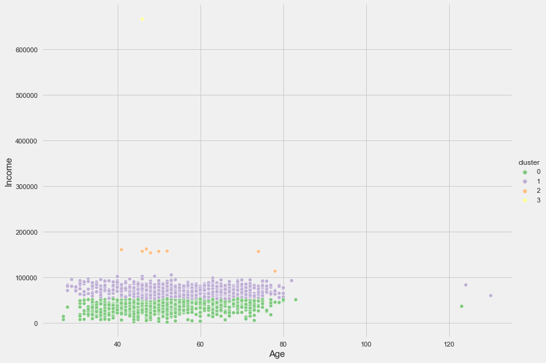
    


```python
best_cols = ["Education", "Income", "Recency","Wines", "Fruits", "Meat","Gold","cluster"]
sns.pairplot(data_ms [ best_cols ], hue="cluster",palette='Accent') 
```


    <seaborn.axisgrid.PairGrid at 0x151dd2a90>


    
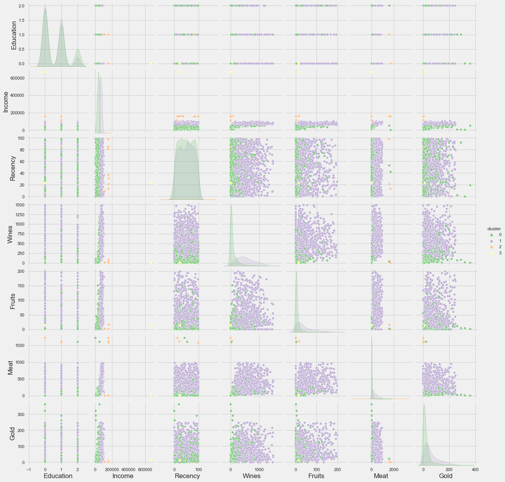
    


```python
## method Birch
from sklearn.cluster import Birch
# Initialize the BIRCH model
birch = Birch(n_clusters=4)

# Fit the BIRCH model to the data
birch.fit(Data)

# Extract the cluster labels
labels = birch.labels_

# Print the number of clusters
n_clusters = len(np.unique(labels))
print(f"Number of clusters: {n_clusters}")
```

    Number of clusters: 4


```python
data_birch = Data.copy()
data_birch['cluster'] = birch.labels_
sns.relplot(data = data_birch ,x='Age' , y  ='Income', hue='cluster', palette='Accent' ,kind='scatter', height=8.27, aspect = 11.7/8.27)
#plt.scatter(centroids[:, 0], centroids[:,1], c='red', s=50)
plt.xlabel("Age",fontsize=15)
plt.ylabel("Income",fontsize=15)
plt.xlabel("Age",fontsize=15)
plt.ylabel("Income",fontsize=15)
```


    Text(14.315430614909786, 0.5, 'Income')


    
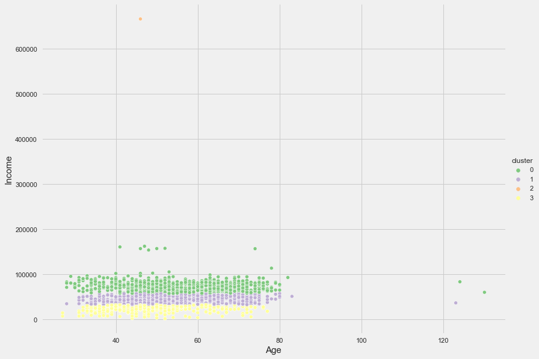
    


```python
best_cols = ["Education", "Income", "Recency","Wines", "Fruits", "Meat","Gold","cluster"]
sns.pairplot(data_birch [ best_cols ], hue="cluster",palette='Accent') 
```


    <seaborn.axisgrid.PairGrid at 0x16a8a5cd0>


    

    


```python

```
